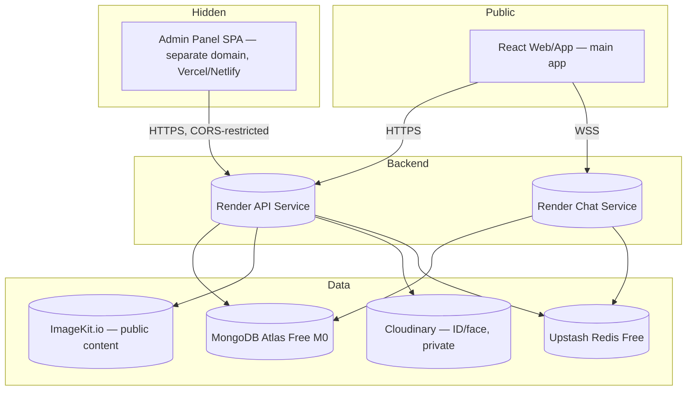
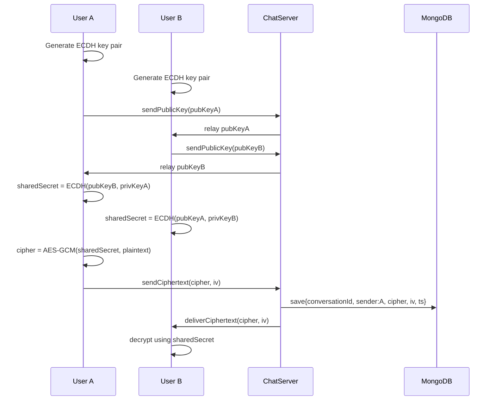

# Backend Architecture — College Dating App

## Executive Summary

This document describes a two-service backend for a college dating app, built on **Render free-tier web services**, **Node.js/Express with Socket.IO**, **MongoDB Atlas M0 (free)**, **Upstash Redis (free)**, and **two separate image CDNs** — **ImageKit.io** for general-purpose images and **Cloudinary** for identity-verification images.

The backend splits into an **API service** (auth, profiles, discovery, likes/matches, posts, reports, identity verification, flagging, admin) and a **Chat service** (Socket.IO real-time messaging). Each runs in its own Render account for its own 750-free-instance-hour pool, with a manual failover procedure to survive month-end hour exhaustion.

A third surface, the **admin panel frontend**, is deployed separately from both — on its own domain, hosted outside Render entirely (Vercel/Netlify free static hosting), unlinked from anything in the main app and not discoverable through it. Admin identity is not a role flag on a regular user account; it's a fully separate credential model driven by an **email allowlist hardcoded in environment variables**, plus a **shared common password** that every admin must supply alongside their own personal password on every login.

Expected load: ~1,000 registered users, 100–300 daily active, up to 100 concurrent at peak.

Key design points:
- **Admin panel isolation**: separate domain, separate hosting, separate CORS origin, separate auth flow and JWT scope, separate Mongo collection — no privilege-escalation path runs through the regular `users` collection at all.
- **Admin identity is allowlist-driven, not self-service**: only emails present in `ADMIN_EMAILS` (an env var) can ever create an admin account; nobody can grant themselves admin access through the API.
- **Two-secret admin login**: personal password (set on first signup) plus a common password shared across the admin team (from env) — both must be correct to log in.
- **Signup requires camera-captured ID card and face images** (regular users only, not admins), submitted for admin review. (A req will be sent to the admin panel with all the submitted details)
- **A dedicated `likes` collection** for correct mutual-match detection and quota enforcement.
- **A `blocks` collection**, separate from moderation reports.
- **Two CDNs, split by sensitivity**: ImageKit for public content, Cloudinary for private identity-verification images.
- **Redis (Upstash)** used narrowly: counters, OTP, rate limiting, presence, feed caching, idempotency, behavioral-velocity tracking for flagging.
- **Rule-based unusual-activity flagging**, inline, no separate anomaly service.
- **End-to-end encrypted chat** via client-side ECDH + AES-GCM.
- **Manual two-account failover** to stay within Render's free-tier instance hours.

---

## Architecture Overview

Three deployed surfaces:

- **API Service** (Render, its own account) — Express REST API: user auth, verification (email OTP + identity), profiles, discovery, likes/matches, posts, reports, blocks, flags, and all `/api/admin/*` routes.
- **Chat Service** (Render, its own account) — Express + Socket.IO: real-time messaging, presence.
- **Admin Panel Frontend** (Vercel/Netlify free tier, its own domain) — a static/SPA app that calls the API service's `/api/admin/*` routes. Deliberately kept off Render so it consumes none of the API/Chat services' instance-hour budget, and so it can sit on a domain with no DNS or branding relationship to the main app.

All backend services connect to **MongoDB Atlas M0**, **Upstash Redis**, **ImageKit.io**, and **Cloudinary**.



### Why two Render accounts (API + Chat)

Render's 750 free instance hours are pooled per workspace — two always-on services in one account burn that pool in ~16 days. Each service runs in its own Render account for isolation without losing free-tier status (see **Free-Tier Operations**).

### Why the admin panel is a separate domain, hosted separately

- **No link, no discovery path**: nothing in the main app's HTML/JS bundle, sitemap, or DNS zone references the admin domain. It isn't reachable by browsing the product.
- **Isolated blast radius**: a compromise or misconfiguration on the main frontend can't expose or redirect to the admin surface, because they aren't part of the same deployment or codebase.
- **No Render hours spent**: hosting it as a static SPA on Vercel/Netlify's free tier means a third always-on surface doesn't compete with the API/Chat services for the 750-hour pool.

**Honest limitation**: a hidden domain is a deterrent, not a security boundary. If the admin domain uses a TLS certificate from Let's Encrypt (as most free hosts provide automatically), that certificate is published in public Certificate Transparency logs — anyone can query `crt.sh` for your root domain and see the subdomain, regardless of how obscure the name is or how carefully it's kept unlinked. Treat domain obscurity as a minor layer that reduces casual discovery and scanning noise, not as the thing actually protecting the admin panel — that job belongs to the auth model below. Additional hardening worth considering: `robots.txt` disallow-all and a `noindex` meta tag on the admin SPA (stops search engines, not targeted lookups), and IP allowlisting at the CDN/host level if the admin team works from a small number of static IPs.

---

## Admin Access & Authentication

Admin accounts are **not** a role on a regular `users` document — they're a fully separate identity, collection, and login flow. This removes any path where a bug in the dating-app user model (roles array, profile updates, etc.) could ever be leveraged into admin access.

### Environment variables (API service)
| Variable | Purpose |
|---|---|
| `ADMIN_EMAILS` | Comma-separated allowlist. Only these emails can ever create an admin account. Adding or removing an admin requires editing this and redeploying — deliberately, so admin provisioning has no runtime API surface at all. |
| `ADMIN_COMMON_PASSWORD_HASH` | A bcrypt hash of the shared password every admin must supply alongside their own personal password. Rotate by updating this value and redeploying; it isn't tied to any individual admin's credential, so rotating it doesn't lock anyone out of their personal password. |
| `ADMIN_PANEL_ORIGIN` | The admin SPA's exact origin (scheme + domain), used to lock down CORS on `/api/admin/*` to this origin only — no wildcard. |

### `admins` collection (new, separate from `users`)
```
{
  _id, email, passwordHash, active: Bool (default true),
  createdAt, lastLoginAt
}
```
- Unique index on `email`.
- `active` lets you cut off an existing admin's login without deleting their document (which would break `adminActions` references pointing at their `_id`). **Revoking an admin fully requires two steps**: remove their email from `ADMIN_EMAILS` (blocks any future re-signup) *and* set their `admins.active = false` (blocks their existing, already-created login). Removing only from the env var doesn't touch an account that already exists in Mongo.

### Signup flow (first-time only, per admin)
1. `POST /api/admin/auth/signup` — `{email, password}`, called only from the admin SPA's origin.
2. Server checks `email` against `ADMIN_EMAILS`. Not present → generic rejection (don't reveal whether the email was almost-right; avoids allowlist enumeration).
3. If present and no `admins` document exists yet for that email, hash the password (bcrypt/argon2) and create the document. This is the admin's **personal password** — theirs alone, never shared.
4. If an `admins` document already exists for that email, reject — signup is one-time per admin; afterward they use login.

### Login flow (every time after)
1. `POST /api/admin/auth/login` — `{email, password, commonPass}`.
2. Server checks: `admins` document exists and `active: true`; `password` matches `passwordHash`; `commonPass` matches `ADMIN_COMMON_PASSWORD_HASH`. All three must pass.
3. On success, issue a JWT scoped specifically for the admin panel (a distinct signing claim, e.g. `aud: 'admin-panel'`), returned as a bearer token to the SPA rather than an HTTP-only cookie — since the admin SPA and API service are on different domains, cross-site cookies mean fighting `SameSite`/`Secure` configuration for no real benefit here; a bearer token held in the SPA's memory and sent via `Authorization: Bearer <token>` is simpler and avoids that entirely.
4. Every `/api/admin/*` route (other than signup/login themselves) requires this admin-scoped JWT — a regular user's JWT, even one somehow carrying a forged "admin" claim, has the wrong audience and is rejected outright.

This means logging into the admin panel takes three pieces of information: the admin's email, their personal password, and the common password — the common password alone (if it leaked) grants nothing without a valid personal password on file, and a personal password alone (if guessed or leaked) grants nothing without the common password.

### Relationship to the regular `users` collection
An admin's email may or may not also have a normal dating-app account in `users` — these are entirely unrelated identities that happen to share an email address. Creating an `admins` document does not create, modify, or touch a `users` document, and vice versa. An admin does not show up in discovery, does not have a dating profile, and none of the dating-specific schema applies to them.

---

## Data Models

### `users`
| Field | Type | Notes |
|---|---|---|
| `_id` | ObjectId | PK |
| `email` | String, unique | domain match determines insider/outsider tier |
| `username` | String, unique | |
| `name`, `age` | | `age` checked against minimum age at signup |
| `school`, `course` | String | indexed |
| `gender` | Enum | indexed |
| `height` | Number (cm) | |
| `pictures` | Array (≤4) `{url, fileId}` | ImageKit references |
| `hobbies`, `skills` | Array\<String\> | combined text index with `bio` |
| `lookingFor` | Enum: friends/dating | |
| `bio` | String | text-indexed |
| `tags` | Object | e.g. `{smoke, drink, pets}` |
| `sexualOrientation` | Enum | |
| `isPremium` | Bool | |
| `badges` | Array\<String\> | |
| `banned`, `banReason` | Bool, String | |
| `emailVerified` | Bool | college-email OTP confirmed — drives insider/outsider quota tier |
| `identityStatus` | Enum: `not_submitted` \| `pending` \| `verified` \| `unverified` | drives the public "Verified" badge |
| `identityReviewReason` | String, nullable | |
| `identityReviewedBy` | ObjectId, nullable | references `admins._id` |
| `identityReviewedAt` | Date, nullable | |
| `openFlagCount` | Number, default 0 | for admin-list sorting |
| `createdAt`, `updatedAt` | Date | |

No `roles` field — every document in `users` is, by definition, a regular dating-app user. Admin status is never represented here.

### `accountFlags`
```
{
  _id, userId, flagType, severity: 'low'|'medium'|'high',
  details: Object, status: 'open'|'reviewed'|'dismissed'|'actioned',
  createdAt, reviewedBy (references admins._id), reviewedAt
}
```
Index on `(status, severity, createdAt)`; index on `userId`.

### `identityVerificationRequests`
```
{
  _id, userId,
  idCardImage: { url, publicId }, faceImage: { url, publicId },
  idCardHash: String, faceHash: String,
  status: 'pending'|'verified'|'unverified', reason: String,
  submittedAt, reviewedBy (references admins._id), reviewedAt
}
```
Index on `(status, submittedAt)`; index on `idCardHash` and `faceHash`.

### `emailVerifications`
```
{ _id, email, otpHash, userId, purpose: 'signup'|'reverify', attempts, createdAt }
```
TTL index on `createdAt`, `expireAfterSeconds: 600`.

### `likes`
```
{ _id, fromUserId, toUserId, type: 'like'|'superlike', createdAt }
```
Unique compound index `(fromUserId, toUserId)`.

### `matches`
```
{ _id, userA, userB, matchedAt, conversationId }
```
Sorted-pair unique index `(userA, userB)`.

### `messages`
```
{ _id, conversationId, senderId, ciphertext, iv, timestamp, delivered }
```
Index `(conversationId, timestamp)`.

### `blocks`
```
{ _id, blockerId, blockedId, createdAt }
```
Unique compound index `(blockerId, blockedId)`.

### `anonymousPosts`
```
{ _id, content, postedAt }
```
Index on `postedAt`.

### `reports`
```
{ _id, reporterId, targetUserId, targetPostId, reason, status, createdAt }
```
Index on `status`, `createdAt`.

### `adminActions`
```
{ _id, actionType, adminId, targetUserId, details, createdAt }
```
`adminId` now references `admins._id`, not `users._id`.

### `announcements`, `feedback`, `waitlist`
Unchanged.

---

## Unusual Activity Detection & Flagging

Rule-based, inline checks written into the request path that already exists for each action — no separate anomaly service, no ML scoring model.

| Flag type | Trigger | Where checked | Default severity |
|---|---|---|---|
| `login_brute_force` | N failed logins for one account in a short window | `/api/auth/login`, Redis counter | medium |
| `signup_cluster` | N signups from same IP/device fingerprint within an hour | `/api/auth/signup`, Redis counter | medium |
| `like_velocity_spike` | Likes/superlikes faster than plausible manual pacing | `/api/like`, `/api/superlike` | low |
| `mass_report_target` | Unusually high reports against one user in a short window | `/api/report` | high |
| `mass_block_target` | Unusually high blocks against one user in a short window | `/api/block/:targetId` | medium |
| `message_spam_pattern` | Unusually many distinct new matches messaged in a short window | Chat service, per-user Redis set of touched conversations | medium |
| `duplicate_identity_document` | Perceptual hash of submitted ID/face matches a **different** account's | `/api/verification/identity/submit` | high |
| `repeated_verification_rejection` | Multiple `unverified` outcomes for one account | `/api/verification/identity/resubmit` | medium |
| `post_spam` | Unusually frequent anonymous posting | `/api/posts` | low |

Because chat is end-to-end encrypted, message-based flagging can only ever be metadata/frequency-based, never content-based — worth remembering when tuning `message_spam_pattern`.

Review flow: **Dismiss** (false positive), **Mark reviewed** (acknowledged, no action), or **Action** (jumps into the ban flow). All three log to `adminActions` with the reviewing admin's `_id` and decrement `users.openFlagCount`.

---

## Identity Verification (ID Card + Face Capture)

Regular users only — not part of the admin flow.

1. Client captures both images live via `getUserMedia()` + canvas snapshot (not a file picker, which can fall back to gallery selection on some browsers).
2. `POST /api/verification/identity/submit` (multipart). Server computes a perceptual hash of each image and checks against existing hashes on other users' requests — a match creates a `duplicate_identity_document` flag immediately.
3. Both images uploaded to **Cloudinary** with `type: authenticated` (private) delivery; `{url, publicId}` plus hashes stored on a new `pending` request.
4. Admin panel lists pending requests with short-lived signed preview URLs, surfacing any duplicate-document flag inline.
5. Admin picks: **Approve** (`identityStatus: verified`) or **Reject with reason** (`identityStatus: unverified`, account keeps functioning normally, reason shown to the user, resubmission allowed).
6. Both outcomes logged to `adminActions`.

**Data retention**: consider deleting Cloudinary assets after a fixed window post-review; retain the perceptual hash even after deletion so duplicate-document detection still works against historical submissions.

---

## Redis (Upstash) — Usage

Free tier: 256MB data, 500K commands/month, 10GB bandwidth.

| Use case | Pattern |
|---|---|
| Daily like/superlike counters | `INCR user:{id}:likes`, `EXPIREAT` to next UTC midnight |
| Signup/reverify OTP | `SET otp:{email} {hash} EX 600` |
| Auth & like-endpoint rate limiting | `@upstash/ratelimit` |
| Presence | `SET presence:{userId} 1 EX 120` |
| Discovery feed cache | `SET discover:{userId} [...] EX 180` |
| Idempotency on POSTs | `SET idem:{requestId} 1 EX 30 NX` |
| Failed-login counter (flagging) | `INCR failedLogin:{email} EX 900` |
| Signup-cluster counter (flagging) | `INCR signup:{ipOrFingerprint} EX 3600` |
| Like/superlike velocity (flagging) | Sorted set of recent timestamps per user |
| Distinct-conversation counter (flagging) | Set of `conversationId`s touched per user in the window |

Not used as a Socket.IO pub/sub adapter — irrelevant on a single instance per service.

---

## API Endpoints

### Regular user auth & app (no admin logic anywhere in this group)
| Method | Path | Auth | Purpose |
|---|---|---|---|
| POST | `/api/auth/signup` | No | Create user; OTP if college domain matched; checks signup-cluster counter |
| POST | `/api/auth/verify-otp` | No | Confirms OTP, sets `emailVerified: true` |
| POST | `/api/auth/resend-otp` | No | Rate-limited |
| POST | `/api/auth/login` | No | JWT cookie; increments failed-login counter on failure |
| POST | `/api/auth/logout` | Yes | Clears cookie |
| POST | `/api/verification/identity/submit` | Yes | Hash-checked, uploaded to Cloudinary, creates a `pending` request |
| POST | `/api/verification/identity/resubmit` | Yes | Only if `unverified` |
| GET | `/api/verification/identity/status` | Yes | Own status + reason if `unverified` |
| GET | `/api/users/me` | Yes | Own profile |
| PUT | `/api/users/me` | Yes | Update profile/photos |
| GET | `/api/discover` | Yes | Paginated feed |
| POST | `/api/like/:targetId`, `/api/superlike/:targetId` | Yes | Quota-checked, velocity-checked |
| GET | `/api/matches` | Yes | List matches |
| POST/DELETE | `/api/block/:targetId` | Yes | Block/unblock |
| POST | `/api/report` | Yes | Report a user/post |
| POST/GET | `/api/posts` | Yes | Create/list anonymous posts |
| POST | `/api/feedback` | Yes | Submit feedback |
| GET | `/api/health` | No | Health check |

### Admin auth (only reachable from the admin SPA's origin via CORS)
| Method | Path | Auth | Purpose |
|---|---|---|---|
| POST | `/api/admin/auth/signup` | No (allowlist-gated) | First-time only; rejects if email not in `ADMIN_EMAILS` or already registered |
| POST | `/api/admin/auth/login` | No (three-factor: email + password + common pass) | Issues admin-scoped bearer JWT |
| POST | `/api/admin/auth/logout` | Admin JWT | Invalidate client-side token |

### Admin operations (all require a valid admin-scoped JWT)
| Method | Path | Purpose |
|---|---|---|
| GET | `/api/admin/verification-requests` | Pending queue, signed URLs, inline flags |
| POST | `/api/admin/verification-requests/:id/approve` | Approve |
| POST | `/api/admin/verification-requests/:id/reject` | Reject with reason |
| GET | `/api/admin/flags` | Open flags, filterable |
| GET | `/api/admin/flags/user/:userId` | Flag history for one account |
| POST | `/api/admin/flags/:id/dismiss` \| `/review` \| `/action` | Review outcomes |
| GET | `/api/admin/users`, `/api/admin/users/:id` | List/paginate/view users |
| POST | `/api/admin/users/:id/ban` \| `/premium` \| `/badge` | Standard admin actions |
| GET | `/api/admin/reports` | List reports |
| POST | `/api/admin/announce` | Create announcement |
| GET | `/api/admin/feedback` | View feedback |

Note the path prefix shift from the previous `/api/users/:id/ban` etc. to `/api/admin/users/:id/ban` — grouping every admin-only route under `/api/admin/*` makes the CORS/origin restriction and the JWT-audience check a single consistent rule applied to one path prefix, rather than scattered role checks across the general API surface.

---

## College Email Verification

- Domain check, anchored: `/@stu\.adamasuniversity\.ac\.in$/i`.
- OTP hashed, stored in Redis with `EX 600`, sent via Resend or Brevo.
- `/api/auth/verify-otp` sets `emailVerified: true`.
- Entirely separate from admin auth and from `identityStatus`.

---

## End-to-End Encrypted Messaging

Unchanged: client-side ECDH + AES-GCM, server relays/stores ciphertext only.



Key persistence, Socket.IO JWT handshake auth, and `bulkWrite`-batched message writes are unchanged from the prior design.

---

## Image CDN Integration

- **ImageKit**: profile pictures and post images, public CDN delivery, guardrails on size/count/MIME type.
- **Cloudinary**: ID card and face-capture images only, `authenticated` (private) delivery, signed URLs for admin review. Free tier: 25 credits/month (1 credit = 1GB storage, 1GB bandwidth, or 1,000 transformations, shared pool) — compress images before upload and enforce retention deletion to stay comfortably inside this.

---

## User Permissions & Quotas

Daily quotas (Redis-enforced, UTC midnight reset), based on `emailVerified`:
- **Verified insider**: unlimited likes, 5 superlikes/day.
- **Outsider — male**: 5 likes, 1 superlike/day.
- **Outsider — female**: 5 likes, 5 superlikes/day.

`identityStatus` affects only the public verified badge, not quotas.

**Admin capabilities** (via the separate `admins` identity described above): ban/unban with reason, view/list users, review reports, review identity-verification requests, review the flags queue, grant/revoke premium and badges, read feedback, post announcements, manage the waitlist, view service health metrics.

---

## Deployment & Free-Tier Resource Planning

| Resource | Free Tier Limit | Expected Usage |
|---|---|---|
| Render web service (each) | 0.1 vCPU, 512MB RAM, 750h/month per workspace | API instance + Chat instance, each its own Render account |
| Admin panel hosting | Vercel/Netlify free static/SPA tier | Separate domain, zero Render hour cost |
| Upstash Redis | 256MB data, 500K commands/month, 10GB bandwidth | Comfortable given the use cases above |
| MongoDB Atlas M0 | 512MB storage, 500 connections, ~100 ops/sec | Kept low via Redis caching |
| ImageKit | Free-tier bandwidth (verify current plan before launch) | Public content |
| Cloudinary | 25 credits/month (shared pool) | Verification images only |
| WebSocket connections | ~100 concurrent (Render-stated) | At the edge at 100 concurrent chatters |

Note: MongoDB Atlas restructured its lower tiers — the legacy M2/M5 shared clusters were retired and folded into a new usage-based **Flex** tier (~$8–30/month). When Atlas M0's 512MB fills up, the upgrade path is now **M0 → Flex → Dedicated (M10+)**, not M0 → M2/M5 as older guides describe.

### Free-Tier Operations: Two-Account Manual Failover (API + Chat only)

1. Deploy the same repo/env vars to a primary and standby Render account per service.
2. Track cumulative uptime since the 1st via a scheduled `/api/health` job.
3. Near ~700/750 hours on the primary, manually repoint DNS/CNAME to the standby.
4. Flip back on the 1st.

The admin panel, being hosted outside Render, has no equivalent hour budget to manage.

### When to upgrade off free tier

- **Chat service** first, under sustained 100-concurrent bursts.
- **MongoDB Atlas**: to Flex once storage approaches ~450MB.
- **Cloudinary**: enforce the retention policy before considering a paid tier.

### Backups

Weekly `mongodump` via a scheduled **GitHub Actions** workflow (free minutes, runs outside Render entirely) piping to **Backblaze B2** (10GB free, no expiry window) — not AWS S3, which is only free for 12 months and 5GB.

---

## Admin Panel & Monitoring

- **Authentication gate**: email + personal password + common password, on a domain not linked from the main app.
- **User management**: users (sortable by open flag count), reports, waitlist, feedback, announcements.
- **Flags queue**: open flags, highest-severity-oldest-first.
- **Identity verification queue**: pending requests, signed-URL previews, duplicate-document flags inline.
- **Moderation**: reports, bans, badges/premium.
- **Service health**: CPU/RAM, instance-hours this month, WebSocket count, Redis/Mongo/Cloudinary usage against their respective free-tier budgets.
- **Controls**: restart, rollback, manual DNS failover trigger, chat maintenance mode.

---

## Security Measures

- **Regular user auth**: JWT in HTTP-only, SameSite cookies; short expiry with silent refresh.
- **Admin auth**: separate `admins` collection, allowlist-gated signup, two-secret login (personal + common password), admin-scoped JWT delivered as a bearer token (not a cookie, since the admin SPA and API are cross-origin).
- **CORS**: `/api/admin/*` allows only `ADMIN_PANEL_ORIGIN`, no wildcard; the main app's origin is allowlisted separately for its own routes.
- **Admin revocation**: requires both removing the email from `ADMIN_EMAILS` (blocks future signup) and setting `admins.active = false` for that account (blocks existing login) — removing only from the env var leaves an already-created account able to log in.
- **Domain obscurity caveat**: TLS certificates are logged publicly in Certificate Transparency; a hidden admin domain is a deterrent against casual discovery, not a boundary that holds against targeted lookup — the two-secret login is the actual control.
- **Authorization**: every user-route handler verifies `req.user.id` matches the resource owner.
- **Identity-verification images**: Cloudinary `authenticated` delivery only, signed URLs, admin-session-gated.
- **Input validation, rate limiting, CSRF, HTTPS/WSS, Socket.IO handshake auth, minimum-age enforcement, E2EE moderation limitation, `helmet`, ephemeral filesystem**: unchanged from the prior design.

---

## Testing & Load Expectations

| Scenario | Expected Strain | Recommendation |
|---|---|---|
| 100 users browsing profiles | ~100 rps | Fine with discovery caching |
| 50 users in chat, idle | 50 open WSS connections | ~2–4MB memory |
| 20 users messaging simultaneously | 200 msg/s aggregate | `bulkWrite` batching |
| 100 concurrent active chatters | Near WebSocket ceiling | Threshold for paid chat upgrade |
| Verification submissions during a signup wave | Cloudinary storage credits | Compress images, monitor credits |
| Admin login attempts from an unexpected origin | Should be rejected at CORS before reaching auth logic | Confirm this in testing, not just assumed |

| Metric | Free Limit | Expected Load | Upgrade Threshold |
|---|---|---|---|
| CPU (per instance) | 0.1 vCPU | 30–50% under normal load | >80% sustained |
| Memory | 512MB | ~150–350MB with ~100 sockets | >450MB |
| WebSocket connections | ~100 | ~50–100 simultaneous | Approaching 100 |
| DB ops/sec | ~100/sec | <30/sec typical | >80/sec sustained |
| Redis commands | 500K/month | Low | Approaching 400K/month |
| Cloudinary credits | 25/month | Low if compressed + retention enforced | Approaching 20/month |

---

## Implementation Checklist

- [ ] Provision two Render accounts per backend service; test manual DNS failover once
- [ ] Deploy admin SPA to Vercel/Netlify on a domain unlinked from the main app; `robots.txt` disallow-all + `noindex`
- [ ] Set `ADMIN_EMAILS`, `ADMIN_COMMON_PASSWORD_HASH`, `ADMIN_PANEL_ORIGIN` in the API service's environment
- [ ] `admins` collection + signup/login endpoints with allowlist gating and two-secret login
- [ ] CORS locked to `ADMIN_PANEL_ORIGIN` for all `/api/admin/*` routes
- [ ] Admin-scoped JWT (distinct audience claim), bearer-token delivery to the SPA
- [ ] MongoDB Atlas M0 cluster, IP allowlist, credentials
- [ ] Upstash Redis instance, scoped to listed use cases including flagging counters
- [ ] ImageKit (public) + Cloudinary (verification, `authenticated` delivery) integrations
- [ ] Camera-only capture UI for ID card + face images
- [ ] Perceptual-hash duplicate-document detection
- [ ] `users`, `admins`, `accountFlags`, `identityVerificationRequests`, `emailVerifications`, `likes`, `matches`, `messages`, `blocks`, `reports`, `adminActions`, `announcements`, `feedback`, `waitlist` schemas and indexes
- [ ] Flagging checks wired into signup, login, like/superlike, report, block, post, and message paths
- [ ] Admin flags queue and identity-verification review queue, both gated by admin JWT
- [ ] Verification-image retention/deletion job, preserving hashes after deletion
- [ ] Socket.IO JWT handshake auth, `bulkWrite`-batched message persistence
- [ ] E2EE key-persistence approach decided and documented
- [ ] Rate limiting via Redis on auth, like/report, and verification-submit endpoints
- [ ] GitHub Actions weekly `mongodump` → Backblaze B2
- [ ] Minimum-age check at signup
- [ ] Load test at 100 concurrent; confirm CORS actually rejects non-admin origins on `/api/admin/*`
- [ ] Document and practice the admin-revocation procedure (env removal + `active: false`) before it's needed for real